# 胸部CT影像肺叶自动分割系统 - 技术设计文档

## 文档信息

| 项目 | 内容 |
|------|------|
| 系统名称 | 胸部CT影像肺叶自动分割系统 |
| 文档版本 | v1.0 |
| 创建日期 | 2025-06-17 |
| 文档类型 | 技术设计文档 |

## 1. 实现模型

### 1.1 上下文视图

```plantuml
@startuml
actor "放射科医师" as Radiologist
actor "医学研究人员" as Researcher
actor "系统管理员" as Admin
rectangle "胸部CT影像肺叶自动分割系统" as System {
    rectangle "图形用户界面" as GUI
    rectangle "核心处理引擎" as Engine {
        rectangle "数据管理模块" as DataManager
        rectangle "预处理模块" as Preprocessor
        rectangle "模型训练模块" as Trainer
        rectangle "模型推理模块" as Inference
        rectangle "可视化模块" as Visualizer
        rectangle "评估模块" as Evaluator
    }
    rectangle "存储层" as Storage {
        rectangle "文件存储" as FileStorage
        rectangle "模型存储" as ModelStorage
        rectangle "配置存储" as ConfigStorage
    }
}

Radiologist -> GUI : 本地交互
Researcher -> GUI : 本地交互
Admin -> GUI : 本地交互
GUI -> DataManager : 数据导入/管理
GUI -> Preprocessor : 预处理配置
GUI -> Trainer : 训练控制
GUI -> Inference : 推理请求
GUI -> Visualizer : 可视化请求
GUI -> Evaluator : 评估请求

DataManager -> FileStorage : 存储CT影像
Trainer -> ModelStorage : 保存训练模型
Inference -> ModelStorage : 加载训练模型
Preprocessor -> FileStorage : 读取/写入预处理数据
Visualizer -> FileStorage : 读取影像和结果
Evaluator -> FileStorage : 读取结果和标签

note right of GUI
    技术栈：
    - Python 3.8+
    - Qt 5/PyQt5 或 Streamlit
    - Plotly/Matplotlib
end note

note right of Engine
    技术栈：
    - Python 3.8+
    - nnU-Net v2
    - PyTorch 1.12+
    - SimpleITK/Monai
    - NumPy, SciPy
end note

note right of Storage
    存储：
    - 本地文件系统
    - HDF5 (可选)
end note

@enduml
```



### 1.2 服务/组件总体架构

#### 1.2.1 系统架构设计

采用分层架构设计，具体如下：

**用户界面层**
- **框架选择**：PyQt5（桌面应用）或 Streamlit（Web应用）
- **视图层**：组件化设计，支持数据上传、参数配置、结果展示
- **交互层**：实时进度显示、训练监控、可视化交互
- **可视化层**：2D切片查看器、3D体积渲染、统计图表

**核心处理层**
- **数据管理模块**：负责CT影像的导入、格式转换、数据集组织
- **预处理模块**：实现重采样、归一化、裁剪、数据增强
- **模型训练模块**：基于nnU-Net框架的训练流程管理
- **模型推理模块**：单个和批量推理、后处理优化
- **可视化模块**：2D/3D可视化、结果叠加、对比显示
- **评估模块**：性能指标计算、结果分析、模型对比

**存储层**
- **文件存储**：原始CT影像、预处理数据、分割结果
- **模型存储**：训练好的模型权重、配置文件、检查点
- **配置存储**：系统配置、用户设置、训练参数

#### 1.2.2 目录结构设计

```
ct-lung-lobe-segmentation/
├── data/                       # 数据目录
│   ├── raw/                   # 原始CT影像
│   │   ├── imagesTr/         # 训练影像
│   │   ├── imagesTs/         # 测试影像
│   │   └── labelsTr/         # 训练标签
│   ├── processed/            # 预处理后数据
│   ├── results/              # 分割结果
│   └── models/               # 训练模型
│       ├── nnUNet/          # nnU-Net模型目录
│       │   ├── 2d/          # 2D配置模型
│       │   ├── 3d_lowres/   # 3D lowres配置模型
│       │   ├── 3d_fullres/  # 3D fullres配置模型
│       │   └── 3d_cascade/  # 3D cascade配置模型
│       └── checkpoints/     # 训练检查点
├── src/                       # 源代码目录
│   ├── data/                 # 数据管理模块
│   │   ├── __init__.py
│   │   ├── data_loader.py   # 数据加载器
│   │   ├── data_converter.py # 格式转换器
│   │   ├── dataset_manager.py # 数据集管理
│   │   └── dataset.json     # nnU-Net数据集配置
│   ├── preprocessing/        # 预处理模块
│   │   ├── __init__.py
│   │   ├── resampling.py    # 重采样
│   │   ├── normalization.py # 归一化
│   │   ├── cropping.py      # 裁剪
│   │   └── augmentation.py  # 数据增强
│   ├── training/             # 模型训练模块
│   │   ├── __init__.py
│   │   ├── nnunet_wrapper.py # nnU-Net封装
│   │   ├── trainer.py       # 训练器
│   │   ├── config.py        # 训练配置
│   │   └── monitor.py       # 训练监控
│   ├── inference/            # 模型推理模块
│   │   ├── __init__.py
│   │   ├── predictor.py     # 预测器
│   │   ├── batch_inference.py # 批量推理
│   │   ├── postprocessor.py # 后处理
│   │   └── config.py        # 推理配置
│   ├── visualization/        # 可视化模块
│   │   ├── __init__.py
│   │   ├── viewer_2d.py     # 2D查看器
│   │   ├── viewer_3d.py     # 3D查看器
│   │   ├── overlay.py       # 结果叠加
│   │   └── comparison.py    # 结果对比
│   ├── evaluation/           # 评估模块
│   │   ├── __init__.py
│   │   ├── metrics.py       # 性能指标
│   │   ├── evaluator.py     # 评估器
│   │   ├── comparison.py    # 模型对比
│   │   └── error_analysis.py # 错误分析
│   ├── ui/                   # 用户界面
│   │   ├── __init__.py
│   │   ├── main_window.py   # 主窗口
│   │   ├── data_tab.py      # 数据管理标签页
│   │   ├── training_tab.py  # 训练标签页
│   │   ├── inference_tab.py # 推理标签页
│   │   ├── visualization_tab.py # 可视化标签页
│   │   └── evaluation_tab.py # 评估标签页
│   ├── utils/                # 工具函数
│   │   ├── __init__.py
│   │   ├── logger.py        # 日志工具
│   │   ├── config.py        # 配置管理
│   │   ├── io.py            # I/O工具
│   │   └── validation.py    # 输入验证
│   └── __init__.py
├── configs/                   # 配置文件目录
│   ├── system_config.yaml    # 系统配置
│   ├── preprocessing_config.yaml # 预处理配置
│   ├── training_config.yaml  # 训练配置
│   └── inference_config.yaml # 推理配置
├── tests/                     # 测试目录
│   ├── test_data.py
│   ├── test_preprocessing.py
│   ├── test_training.py
│   ├── test_inference.py
│   ├── test_visualization.py
│   └── test_evaluation.py
├── docs/                      # 文档目录
│   ├── user_guide.md         # 用户指南
│   ├── api_reference.md      # API参考
│   └── developer_guide.md    # 开发者指南
├── scripts/                   # 脚本目录
│   ├── setup_data.py         # 数据准备脚本
│   ├── train_model.py        # 训练脚本
│   ├── run_inference.py      # 推理脚本
│   └── evaluate.py           # 评估脚本
├── requirements.txt           # Python依赖
├── setup.py                   # 安装脚本
├── README.md                  # 项目说明
└── .gitignore
```

### 1.3 实现设计文档

#### 1.3.1 技术选型说明

**核心框架**
- **Python 3.8+**：主要编程语言，提供丰富的科学计算库
- **nnU-Net v2**：医学图像分割深度学习框架，自动配置网络架构和超参数
- **PyTorch 1.12+**：深度学习框架，nnU-Net的后端
- **CUDA 11.0+**：GPU加速支持

**医学影像处理**
- **SimpleITK**：医学影像读写和基础处理
- **MONAI**：医学影像AI框架，提供高级预处理和数据增强
- **Nibabel**：NIfTI格式支持
- **PyDICOM**：DICOM格式支持

**数值计算**
- **NumPy**：数值计算基础库
- **SciPy**：科学计算工具箱
- **Pandas**：数据处理和分析

**可视化**
- **Matplotlib**：2D可视化
- **Plotly**：交互式可视化
- ** itkwidgets**：3D医学影像可视化
- **Napari**：高性能多维图像查看器

**用户界面**
- **PyQt5**：桌面GUI框架（推荐）
- **Streamlit**：Web界面框架（备选）

**其他工具**
- **tqdm**：进度条显示
- **PyYAML**：配置文件管理
- **logging**：日志记录
- **pytest**：单元测试

#### 1.3.2 数据流设计

**训练流程数据流**
```
原始CT影像 (DICOM/NIfTI)
    ↓
数据导入模块
    ↓
格式转换 (统一为NIfTI)
    ↓
数据集组织 (nnU-Net标准结构)
    ↓
预处理模块
    ├─ 重采样 (统一空间分辨率)
    ├─ 归一化 (HU值映射到[0,1])
    ├─ 裁剪 (有效肺部区域)
    └─ 数据增强 (训练时)
    ↓
nnU-Net训练
    ├─ 网络架构搜索
    ├─ 模型训练
    └─ 后处理优化
    ↓
模型保存
```

**推理流程数据流**
```
待分割CT影像
    ↓
数据导入模块
    ↓
预处理模块
    ├─ 重采样
    ├─ 归一化
    └─ 裁剪
    ↓
模型推理
    ├─ 加载训练模型
    ├─ 前向传播
    └─ 生成初步分割
    ↓
后处理模块
    ├─ 去除噪声
    ├─ 平滑边界
    └─ 确保连通性
    ↓
分割结果输出
```

#### 1.3.3 性能优化设计

**内存优化**
- **分块处理**：大型CT影像采用分块加载和处理，避免内存溢出
- **数据流式处理**：使用生成器实现数据流式加载，减少内存占用
- **垃圾回收**：及时释放不再使用的大对象

**计算优化**
- **GPU加速**：充分利用CUDA加速训练和推理
- **多进程处理**：批量推理时使用多进程并行处理
- **批处理策略**：根据GPU内存动态调整batch size
- **混合精度训练**：使用FP16加速训练过程

**I/O优化**
- **缓存机制**：预处理结果缓存，避免重复计算
- **异步I/O**：使用异步I/O提高数据加载速度
- **压缩存储**：使用gzip压缩NIfTI文件，减少磁盘占用

#### 1.3.4 日志与监控

**日志设计**
- **日志级别**：DEBUG、INFO、WARNING、ERROR、CRITICAL
- **日志格式**：时间戳、级别、模块、消息、上下文
- **日志文件**：按日期分割，自动归档
- **日志内容**：记录关键操作、错误信息、训练进度

**监控指标**
- **系统指标**：CPU使用率、内存使用率、GPU使用率、磁盘空间
- **训练指标**：损失值、验证指标、学习率、训练进度
- **推理指标**：处理时间、内存占用、成功率

**健康检查**
- **依赖检查**：检查Python包、CUDA驱动、GPU可用性
- **数据检查**：验证数据格式、数据完整性
- **模型检查**：验证模型文件、配置文件

## 2. 接口设计

### 2.1 总体设计

**接口设计原则**
- 模块化设计，各模块通过清晰的接口通信
- 统一的错误处理机制
- 类型安全，使用类型注解
- 支持同步和异步调用
- 易于测试和维护

**统一响应格式**
```python
@dataclass
class Response:
    success: bool
    message: str
    data: Any = None
    error: Optional[str] = None
    timestamp: datetime = field(default_factory=datetime.now)
```

**错误处理**
```python
class SegmentationError(Exception):
    """分割系统基础异常"""
    pass

class DataLoadError(SegmentationError):
    """数据加载异常"""
    pass

class TrainingError(SegmentationError):
    """训练异常"""
    pass

class InferenceError(SegmentationError):
    """推理异常"""
    pass
```

### 2.2 接口清单

#### 2.2.1 数据管理模块接口

**DataLoader类**
```python
class DataLoader:
    """CT影像数据加载器"""
    
    @staticmethod
    def load_image(file_path: str) -> np.ndarray:
        """
        加载CT影像
        
        Args:
            file_path: 影像文件路径（支持NIfTI和DICOM）
            
        Returns:
            CT影像数组 (H, W, D)
            
        Raises:
            DataLoadError: 文件不存在或格式不支持
        """
        pass
    
    @staticmethod
    def load_label(file_path: str) -> np.ndarray:
        """
        加载分割标签
        
        Args:
            file_path: 标签文件路径
            
        Returns:
            标签数组 (H, W, D)，值为0-5（0:背景, 1-5:肺叶）
            
        Raises:
            DataLoadError: 文件不存在或格式错误
        """
        pass
    
    @staticmethod
    def get_image_info(file_path: str) -> Dict[str, Any]:
        """
        获取影像元信息
        
        Args:
            file_path: 影像文件路径
            
        Returns:
            包含影像信息的字典：
            {
                "spacing": (x, y, z),
                "origin": (x, y, z),
                "direction": (3x3 matrix),
                "shape": (H, W, D),
                "dtype": 数据类型
            }
        """
        pass
```

**DatasetManager类**
```python
class DatasetManager:
    """数据集管理器"""
    
    def __init__(self, dataset_path: str):
        """
        初始化数据集管理器
        
        Args:
            dataset_path: 数据集根目录
        """
        pass
    
    def organize_dataset(self, image_paths: List[str], 
                         label_paths: List[str]) -> Response:
        """
        组织数据集为nnU-Net标准结构
        
        Args:
            image_paths: 影像文件路径列表
            label_paths: 标签文件路径列表
            
        Returns:
            Response对象，包含操作结果
        """
        pass
    
    def generate_dataset_json(self, name: str, 
                              description: str) -> Response:
        """
        生成nnU-Net的dataset.json配置文件
        
        Args:
            name: 数据集名称
            description: 数据集描述
            
        Returns:
            Response对象，包含操作结果
        """
        pass
    
    def validate_dataset(self) -> Response:
        """
        验证数据集完整性
        
        Returns:
            Response对象，包含验证结果
        """
        pass
```

#### 2.2.2 预处理模块接口

**Preprocessor类**
```python
class Preprocessor:
    """CT影像预处理器"""
    
    def __init__(self, config: Dict[str, Any]):
        """
        初始化预处理器
        
        Args:
            config: 预处理配置字典
        """
        pass
    
    def resample(self, image: np.ndarray, 
                 target_spacing: Tuple[float, float, float],
                 original_spacing: Tuple[float, float, float]) -> np.ndarray:
        """
        重采样影像
        
        Args:
            image: 原始影像 (H, W, D)
            target_spacing: 目标体素间距
            original_spacing: 原始体素间距
            
        Returns:
            重采样后的影像
        """
        pass
    
    def normalize(self, image: np.ndarray, 
                  clip_range: Tuple[float, float] = (-1000, 400)) -> np.ndarray:
        """
        归一化HU值到[0, 1]
        
        Args:
            image: CT影像 (H, W, D)
            clip_range: HU值裁剪范围
            
        Returns:
            归一化后的影像
        """
        pass
    
    def crop_lung_region(self, image: np.ndarray, 
                         margin: int = 10) -> Tuple[np.ndarray, Dict[str, Any]]:
        """
        裁剪肺部区域
        
        Args:
            image: CT影像 (H, W, D)
            margin: 边缘保留像素数
            
        Returns:
            (裁剪后的影像, 裁剪参数字典)
        """
        pass
    
    def augment(self, image: np.ndarray, 
                label: np.ndarray) -> Tuple[np.ndarray, np.ndarray]:
        """
        数据增强
        
        Args:
            image: 影像 (H, W, D)
            label: 标签 (H, W, D)
            
        Returns:
            (增强后的影像, 增强后的标签)
        """
        pass
    
    def preprocess(self, image: np.ndarray) -> Response:
        """
        完整的预处理流程
        
        Args:
            image: 原始CT影像
            
        Returns:
            Response对象，包含预处理后的影像
        """
        pass
```

#### 2.2.3 模型训练模块接口

**NNUNetTrainer类**
```python
class NNUNetTrainer:
    """nnU-Net训练器"""
    
    def __init__(self, config: Dict[str, Any]):
        """
        初始化训练器
        
        Args:
            config: 训练配置字典
        """
        pass
    
    def prepare_data(self) -> Response:
        """
        准备训练数据（nnU-Net预处理）
        
        Returns:
            Response对象，包含操作结果
        """
        pass
    
    def train(self, fold: int = 0, 
              resume: bool = False) -> Response:
        """
        启动训练
        
        Args:
            fold: 交叉验证的fold编号
            resume: 是否从检查点恢复
            
        Returns:
            Response对象，包含训练结果
        """
        pass
    
    def get_training_progress(self) -> Dict[str, Any]:
        """
        获取训练进度
        
        Returns:
            包含训练进度的字典：
            {
                "epoch": 当前epoch,
                "total_epochs": 总epoch数,
                "train_loss": 训练损失,
                "val_loss": 验证损失,
                "dice": Dice系数,
                "time_elapsed": 已用时间
            }
        """
        pass
    
    def stop_training(self) -> Response:
        """
        停止训练
        
        Returns:
            Response对象，包含操作结果
        """
        pass
    
    def save_model(self, output_path: str) -> Response:
        """
        保存训练好的模型
        
        Args:
            output_path: 输出路径
            
        Returns:
            Response对象，包含操作结果
        """
        pass
```

#### 2.2.4 模型推理模块接口

**Predictor类**
```python
class Predictor:
    """肺叶分割预测器"""
    
    def __init__(self, model_path: str, config: Dict[str, Any]):
        """
        初始化预测器
        
        Args:
            model_path: 模型文件路径
            config: 推理配置字典
        """
        pass
    
    def predict(self, image: np.ndarray) -> Response:
        """
        单个影像推理
        
        Args:
            image: 预处理后的CT影像
            
        Returns:
            Response对象，包含分割结果：
            {
                "segmentation": 分割掩膜 (H, W, D),
                "probabilities": 每个肺叶的概率 (6, H, W, D),
                "processing_time": 处理时间（秒）
            }
        """
        pass
    
    def predict_batch(self, images: List[np.ndarray]) -> Response:
        """
        批量推理
        
        Args:
            images: 预处理后的CT影像列表
            
        Returns:
            Response对象，包含所有分割结果
        """
        pass
```

**Postprocessor类**
```python
class Postprocessor:
    """分割结果后处理器"""
    
    def __init__(self, config: Dict[str, Any]):
        """
        初始化后处理器
        
        Args:
            config: 后处理配置字典
        """
        pass
    
    def remove_small_objects(self, segmentation: np.ndarray, 
                              min_size: int = 100) -> np.ndarray:
        """
        去除小区域（噪声）
        
        Args:
            segmentation: 分割结果 (H, W, D)
            min_size: 最小区域大小（体素数）
            
        Returns:
            去噪后的分割结果
        """
        pass
    
    def smooth_boundaries(self, segmentation: np.ndarray) -> np.ndarray:
        """
        平滑边界
        
        Args:
            segmentation: 分割结果 (H, W, D)
            
        Returns:
            平滑后的分割结果
        """
        pass
    
    def ensure_connectivity(self, segmentation: np.ndarray) -> np.ndarray:
        """
        确保每个肺叶区域的连通性
        
        Args:
            segmentation: 分割结果 (H, W, D)
            
        Returns:
            连通性修正后的分割结果
        """
        pass
    
    def postprocess(self, segmentation: np.ndarray) -> Response:
        """
        完整的后处理流程
        
        Args:
            segmentation: 原始分割结果
            
        Returns:
            Response对象，包含后处理后的结果
        """
        pass
```

#### 2.2.5 可视化模块接口

**Visualizer2D类**
```python
class Visualizer2D:
    """2D切片可视化器"""
    
    def __init__(self, config: Dict[str, Any]):
        """
        初始化2D可视化器
        
        Args:
            config: 可视化配置字典
        """
        pass
    
    def show_slice(self, image: np.ndarray, 
                   segmentation: Optional[np.ndarray] = None,
                   slice_idx: int = None) -> Response:
        """
        显示单个切片
        
        Args:
            image: CT影像
            segmentation: 分割结果（可选）
            slice_idx: 切片索引（如果为None，显示中间切片）
            
        Returns:
            Response对象，包含可视化结果
        """
        pass
    
    def show_overlay(self, image: np.ndarray, 
                     segmentation: np.ndarray,
                     alpha: float = 0.5) -> Response:
        """
        显示叠加结果
        
        Args:
            image: CT影像
            segmentation: 分割结果
            alpha: 叠加透明度
            
        Returns:
            Response对象，包含可视化结果
        """
        pass
    
    def save_slice(self, output_path: str, 
                   image: np.ndarray,
                   segmentation: Optional[np.ndarray] = None,
                   slice_idx: int = None) -> Response:
        """
        保存切片为图片
        
        Args:
            output_path: 输出路径
            image: CT影像
            segmentation: 分割结果（可选）
            slice_idx: 切片索引
            
        Returns:
            Response对象，包含操作结果
        """
        pass
```

**Visualizer3D类**
```python
class Visualizer3D:
    """3D体积渲染可视化器"""
    
    def __init__(self, config: Dict[str, Any]):
        """
        初始化3D可视化器
        
        Args:
            config: 可视化配置字典
        """
        pass
    
    def render_volume(self, segmentation: np.ndarray,
                      show_labels: List[int] = None) -> Response:
        """
        3D体积渲染
        
        Args:
            segmentation: 分割结果 (H, W, D)
            show_labels: 要显示的标签列表（如果为None，显示全部）
            
        Returns:
            Response对象，包含可视化结果
        """
        pass
    
    def render_comparison(self, segmentation1: np.ndarray,
                         segmentation2: np.ndarray) -> Response:
        """
        渲染对比结果
        
        Args:
            segmentation1: 第一个分割结果
            segmentation2: 第二个分割结果
            
        Returns:
            Response对象，包含可视化结果
        """
        pass
```

#### 2.2.6 评估模块接口

**Evaluator类**
```python
class Evaluator:
    """分割结果评估器"""
    
    def __init__(self, config: Dict[str, Any]):
        """
        初始化评估器
        
        Args:
            config: 评估配置字典
        """
        pass
    
    def calculate_metrics(self, prediction: np.ndarray,
                          ground_truth: np.ndarray) -> Dict[str, Any]:
        """
        计算性能指标
        
        Args:
            prediction: 预测的分割结果
            ground_truth: 金标准标签
            
        Returns:
            包含各项指标的字典：
            {
                "dice": Dice系数,
                "iou": IoU,
                "hausdorff_distance": Hausdorff距离,
                "precision": 精确率,
                "recall": 召回率,
                "per_class": 每个肺叶的指标
            }
        """
        pass
    
    def evaluate_dataset(self, predictions: List[np.ndarray],
                         ground_truths: List[np.ndarray]) -> Response:
        """
        评估整个数据集
        
        Args:
            predictions: 预测结果列表
            ground_truths: 金标准列表
            
        Returns:
            Response对象，包含评估报告
        """
        pass
    
    def compare_models(self, model1_results: List[Dict[str, Any]],
                      model2_results: List[Dict[str, Any]]) -> Response:
        """
        对比两个模型
        
        Args:
            model1_results: 模型1的评估结果列表
            model2_results: 模型2的评估结果列表
            
        Returns:
            Response对象，包含对比报告
        """
        pass
    
    def analyze_errors(self, prediction: np.ndarray,
                      ground_truth: np.ndarray) -> Response:
        """
        错误分析
        
        Args:
            prediction: 预测结果
            ground_truth: 金标准
            
        Returns:
            Response对象，包含错误分析报告
        """
        pass
```

## 3. 数据模型

### 3.1 设计目标

- 使用文件系统存储CT影像、标签和分割结果
- 使用配置文件管理训练参数和系统设置
- 支持多种医学影像格式（NIfTI、DICOM）
- 保持与nnU-Net标准数据结构的兼容性
- 支持模型版本管理和回滚

### 3.2 模型实现

#### 3.2.1 nnU-Net标准数据集结构

```
nnUNet_raw_data_base/nnUNet_raw_data/TaskXXX_LungLobeSegmentation/
├── dataset.json              # 数据集配置文件
├── imagesTr/                # 训练影像目录
│   ├── case_0001_0000.nii.gz
│   ├── case_0002_0000.nii.gz
│   └── ...
└── labelsTr/                # 训练标签目录
    ├── case_0001.nii.gz
    ├── case_0002.nii.gz
    └── ...
```

**dataset.json格式**
```json
{
  "name": "TaskXXX_LungLobeSegmentation",
  "description": "Chest CT Lung Lobe Segmentation",
  "reference": "Reference paper or dataset source",
  "licence": "Dataset license",
  "release": "1.0",
  "tensorImageSize": "3D",
  "modality": {
    "0": "CT"
  },
  "labels": {
    "0": "background",
    "1": "left_upper_lobe",
    "2": "left_lower_lobe",
    "3": "right_upper_lobe",
    "4": "right_middle_lobe",
    "5": "right_lower_lobe"
  },
  "numTraining": 100,
  "numTest": 20,
  "training": [
    {
      "image": "./imagesTr/case_0001_0000.nii.gz",
      "label": "./labelsTr/case_0001.nii.gz"
    }
  ]
}
```

#### 3.2.2 系统配置文件

**system_config.yaml**
```yaml
# 系统配置
system:
  log_level: INFO
  log_dir: logs/
  temp_dir: temp/
  max_workers: 4

# 数据路径
paths:
  data_root: data/
  raw_data: data/raw/
  processed_data: data/processed/
  results: data/results/
  models: data/models/

# GPU配置
gpu:
  device: cuda:0
  use_mixed_precision: true
  allow_growth: true

# 用户界面
ui:
  theme: dark
  language: zh_CN
```

**preprocessing_config.yaml**
```yaml
# 预处理配置
resampling:
  target_spacing: [1.0, 1.0, 1.0]  # x, y, z in mm
  interpolation: bspline            # bspline, linear, nearest

normalization:
  clip_range: [-1000, 400]          # HU值范围
  target_range: [0, 1]

cropping:
  auto_crop: true
  margin: 10                         # 像素
  min_lung_size: 1000               # 最小肺部大小

augmentation:
  enabled: true
  rotation_range: [-15, 15]         # 角度
  flip_probability: 0.5
  scale_range: [0.9, 1.1]
  elastic_deformation: true
```

**training_config.yaml**
```yaml
# 训练配置
nnunet:
  config: 3d_fullres                 # 2d, 3d_lowres, 3d_fullres, 3d_cascade
  folds: 5                           # 交叉验证fold数
  epochs: 1000
  batch_size: 2
  patch_size: [128, 128, 128]

optimizer:
  name: SGD
  lr: 0.01
  momentum: 0.99
  weight_decay: 3e-5

scheduler:
  name: PolyLRScheduler
  max_epochs: 1000

loss:
  name: DiceCELoss
  dice_weight: 0.5
  ce_weight: 0.5

early_stopping:
  enabled: true
  patience: 50
  min_delta: 0.001

checkpoint:
  save_interval: 10                  # 每N个epoch保存一次
  keep_last_n: 5                     # 保留最近N个检查点

validation:
  enabled: true
  interval: 5                        # 每N个epoch验证一次
  save_predictions: true
```

**inference_config.yaml**
```yaml
# 推理配置
model:
  path: data/models/nnUNet/3d_fullres/
  fold: all                          # 0-4 or all for ensemble
  use_best_checkpoint: true

preprocessing:
  use_training_params: true          # 使用训练时的预处理参数

postprocessing:
  enabled: true
  remove_small_objects:
    enabled: true
    min_size: 100                    # 体素数
  smooth_boundaries:
    enabled: true
    iterations: 2
  ensure_connectivity:
    enabled: true

inference:
  batch_size: 1
  use_mixed_precision: true
  use_sliding_window: true
  overlap: 0.5                       # 滑动窗口重叠比例

output:
  save_probabilities: false
  save_overlay: true
  format: nii.gz                     # nii.gz, nrrd
```

#### 3.2.3 数据类型定义

**影像元数据类型**
```python
@dataclass
class ImageMetadata:
    """CT影像元数据"""
    file_path: str
    shape: Tuple[int, int, int]      # (H, W, D)
    spacing: Tuple[float, float, float]  # (x, y, z) spacing in mm
    origin: Tuple[float, float, float]   # 原点坐标
    direction: np.ndarray            # 方向矩阵 (3x3)
    dtype: np.dtype                  # 数据类型
    modality: str = "CT"
    
    def to_dict(self) -> Dict[str, Any]:
        """转换为字典"""
        return asdict(self)
```

**分割结果类型**
```python
@dataclass
class SegmentationResult:
    """分割结果"""
    image_path: str
    segmentation: np.ndarray         # 分割掩膜 (H, W, D)
    probabilities: Optional[np.ndarray] = None  # 概率图 (6, H, W, D)
    processing_time: float = 0.0
    model_info: Optional[Dict[str, Any]] = None
    
    def save(self, output_path: str) -> Response:
        """保存分割结果"""
        pass
    
    def get_lobe_mask(self, lobe_id: int) -> np.ndarray:
        """获取指定肺叶的掩膜"""
        pass
```

**训练状态类型**
```python
@dataclass
class TrainingState:
    """训练状态"""
    task_id: str
    config: str                      # nnU-Net配置
    fold: int
    status: str                      # pending, running, completed, failed, stopped
    current_epoch: int = 0
    total_epochs: int = 0
    train_loss: float = 0.0
    val_loss: float = 0.0
    dice_score: float = 0.0
    start_time: Optional[datetime] = None
    end_time: Optional[datetime] = None
    error_message: Optional[str] = None
    
    def is_running(self) -> bool:
        """是否正在训练"""
        return self.status == "running"
    
    def get_progress(self) -> float:
        """获取训练进度（0-1）"""
        if self.total_epochs == 0:
            return 0.0
        return self.current_epoch / self.total_epochs
```

**评估结果类型**
```python
@dataclass
class EvaluationResult:
    """评估结果"""
    case_id: str
    metrics: Dict[str, Any]          # 性能指标
    per_class_metrics: Dict[int, Dict[str, Any]]  # 每个肺叶的指标
    
    def get_dice(self, class_id: Optional[int] = None) -> float:
        """获取Dice系数"""
        if class_id is None:
            return self.metrics.get("dice", 0.0)
        return self.per_class_metrics.get(class_id, {}).get("dice", 0.0)
    
    def to_dict(self) -> Dict[str, Any]:
        """转换为字典"""
        return asdict(self)
```

#### 3.2.4 文件命名规范

**影像文件命名**
- 训练影像：`case_XXXX_0000.nii.gz`（XXXX为4位数字）
- 测试影像：`case_XXXX_0000.nii.gz`
- 标签文件：`case_XXXX.nii.gz`（无需modality后缀）

**模型文件命名**
- 最佳模型：`model_final_checkpoint.model`
- 检查点：`model_ep{epoch}_dice{dice}.model`
- 配置文件：`plans.pkl`（nnU-Net自动生成）

**结果文件命名**
- 分割结果：`case_XXXX_lung_lobe_seg.nii.gz`
- 概率图：`case_XXXX_probabilities.nii.gz`
- 叠加结果：`case_XXXX_overlay.nii.gz`

## 4. 关键技术难点和解决方案

### 4.1 肺叶边界模糊问题

**问题描述**
- 肺叶之间的边界在CT影像中通常不够清晰
- 部分肺叶（如右肺中叶）体积较小，容易被误分类

**解决方案**
- 使用nnU-Net的3D全分辨率配置，充分利用3D上下文信息
- 在训练时对边界区域进行加权，提高边界分割精度
- 后处理中使用形态学操作和平滑算法优化边界
- 引入解剖先验知识，约束肺叶的空间位置关系

### 4.2 数据不平衡问题

**问题描述**
- 不同肺叶的体积差异较大（右肺中叶最小）
- 背景区域远大于肺叶区域，导致训练偏向背景

**解决方案**
- 使用Dice Loss和Cross Entropy Loss的混合损失函数
- 对小肺叶（右肺中叶）的损失进行加权
- 在数据增强时对小肺叶区域进行过采样
- 使用focal loss处理类别不平衡

### 4.3 大尺寸CT影像处理

**问题描述**
- 高分辨率CT影像（512x512x500+）占用大量内存
- 直接处理可能导致GPU内存溢出

**解决方案**
- 采用滑动窗口推理策略，分块处理大影像
- 自动裁剪到有效肺部区域，减少处理体素数
- 动态调整batch size，适应GPU内存限制
- 使用混合精度训练（FP16）减少内存占用

### 4.4 训练时间过长

**问题描述**
- nnU-Net 3D配置训练时间长达数小时甚至数天
- 影响模型迭代和调优效率

**解决方案**
- 使用多GPU并行训练
- 启用混合精度训练加速
- 合理设置early stopping，避免无效训练
- 使用预训练模型（如果有）进行迁移学习

### 4.5 分割结果不一致

**问题描述**
- 对同一影像多次推理结果可能略有不同
- 影响临床应用的可靠性

**解决方案**
- 在推理时固定随机种子
- 使用模型融合（ensemble）提高稳定性
- 后处理中应用连通性约束
- 记录所有随机参数，确保结果可复现

## 5. 安全设计

### 5.1 数据隐私保护

- 自动去除患者个人信息（DICOM头中的姓名、ID等）
- 支持数据加密存储（可选）
- 记录数据访问日志

### 5.2 输入验证

- 验证文件格式（NIfTI、DICOM）
- 验证影像尺寸和体素间距的合理性
- 验证参数范围（防止注入攻击）

### 5.3 错误处理

- 所有异常都捕获并记录日志
- 用户友好的错误提示
- 关键操作的回滚机制

## 6. 可扩展性设计

### 6.1 模型扩展

- 支持集成新的分割模型（通过统一的接口）
- 支持模型热切换（无需重启系统）
- 模型版本管理和回滚

### 6.2 功能扩展

- 模块化设计，易于添加新功能
- 插件式架构（可选）
- 支持自定义预处理和后处理流程

### 6.3 数据格式扩展

- 易于添加新的影像格式支持
- 支持自定义标签格式
- 可扩展的数据集结构

## 附录

### 附录A：nnU-Net配置说明

**2D配置**
- 适用于2D切片处理
- 训练速度快，适合快速原型
- 3D上下文信息有限

**3D lowres配置**
- 低分辨率3D处理
- 内存占用较小
- 适合初步训练

**3D fullres配置**
- 全分辨率3D处理
- 性能最佳
- 内存占用最大

**3D cascade配置**
- 级联架构，先低后高分辨率
- 平衡性能和资源消耗
- 训练时间较长

### 附录B：性能指标说明

**Dice系数**
- 衡量分割准确性的主要指标
- 取值范围[0, 1]，值越大越好
- 计算公式：2|A∩B| / (|A| + |B|)

**Hausdorff距离**
- 衡量分割边界的准确性
- 对离群点敏感
- 单位：毫米

**IoU (Intersection over Union)**
- 交并比
- 取值范围[0, 1]，值越大越好
- 计算公式：|A∩B| / |A∪B|

### 附录C：参考文献

1. nnU-Net: https://github.com/MIC-DKFZ/nnUNet
2. MONAI: https://monai.io/
3. PyTorch: https://pytorch.org/
4. SimpleITK: https://simpleitk.org/
