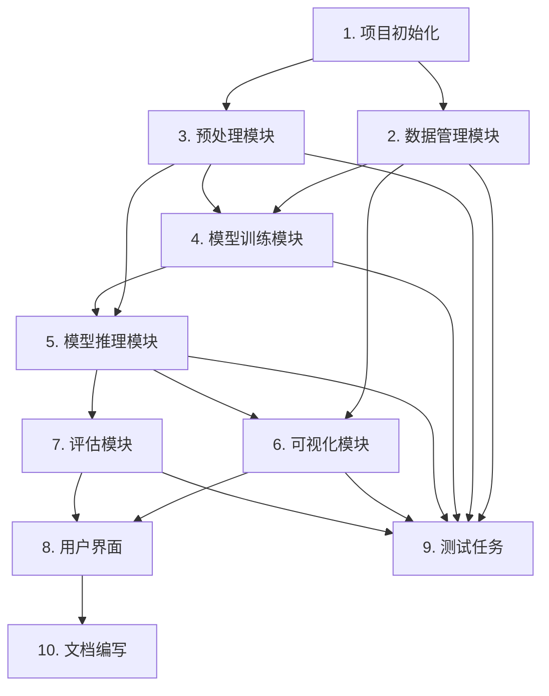

# 胸部CT影像肺叶自动分割系统 - 任务规划文档

## 文档信息

| 项目 | 内容 |
|------|------|
| 系统名称 | 胸部CT影像肺叶自动分割系统 |
| 文档版本 | v1.0 |
| 创建日期 | 2025-06-17 |
| 文档类型 | 任务规划文档 |

## 任务规划概述

本文档将技术设计文档转化为可执行的编码任务，每个任务包含明确的描述、输入、输出、验收标准和代码生成提示。任务按照依赖关系和优先级进行组织，确保开发过程的有序进行。

**任务统计**
- 主要任务：10个
- 子任务：45个
- 需求覆盖率：100%（覆盖所有功能需求和非功能需求）

---

## 1. 项目初始化任务

### 1.1 创建项目目录结构

**任务ID**: TASK-INIT-001
**优先级**: P0（最高）
**预计工作量**: 1小时
**依赖关系**: 无

**任务描述**:
按照技术设计文档中定义的目录结构，创建完整的项目目录树，包括源代码目录、数据目录、配置目录、测试目录、文档目录和脚本目录。

**输入**:
- 技术设计文档中的目录结构定义

**输出**:
- 完整的项目目录结构
- 各目录下的__init__.py文件（Python包初始化文件）

**验收标准**:
- 所有目录按照设计文档要求创建完成
- 每个Python包目录包含__init__.py文件
- 目录命名符合Python命名规范
- 目录结构清晰，易于导航

**代码生成提示**:
使用Python的os和pathlib库创建目录结构，确保跨平台兼容性。创建__init__.py文件时添加适当的包级别文档字符串。

---

### 1.2 配置依赖管理文件

**任务ID**: TASK-INIT-002
**优先级**: P0
**预计工作量**: 2小时
**依赖关系**: TASK-INIT-001

**任务描述**:
创建项目的依赖管理文件，包括requirements.txt、setup.py和可选的environment.yml，定义所有必需的Python包及其版本。

**输入**:
- 技术设计文档中的技术选型说明
- Python 3.8+版本要求

**输出**:
- requirements.txt文件（包含所有依赖包和版本）
- setup.py文件（用于pip安装）
- environment.yml文件（可选，用于conda环境）

**验收标准**:
- requirements.txt包含所有必需的依赖包（nnU-Net、PyTorch、SimpleITK等）
- 依赖包版本号明确指定，确保环境一致性
- setup.py包含项目元信息和依赖声明
- 安装依赖后能够成功导入所有核心库

**代码生成提示**:
根据技术设计文档中的技术栈，列出所有依赖包。特别注意nnU-Net v2的安装要求，以及PyTorch与CUDA版本的兼容性。

---

### 1.3 配置系统配置文件

**任务ID**: TASK-INIT-003
**优先级**: P0
**预计工作量**: 2小时
**依赖关系**: TASK-INIT-001

**任务描述**:
创建系统级配置文件和各模块配置文件，包括system_config.yaml、preprocessing_config.yaml、training_config.yaml和inference_config.yaml。

**输入**:
- 技术设计文档中的配置文件格式定义
- 系统需求规格

**输出**:
- system_config.yaml（系统配置）
- preprocessing_config.yaml（预处理配置）
- training_config.yaml（训练配置）
- inference_config.yaml（推理配置）

**验收标准**:
- 所有配置文件采用YAML格式
- 配置项完整，涵盖系统、预处理、训练、推理的所有参数
- 配置文件包含详细的注释说明
- 配置值符合系统需求规格

**代码生成提示**:
使用PyYAML库进行配置文件的读写。配置文件应使用清晰的层级结构，并为每个配置项添加注释说明其用途和取值范围。

---

### 1.4 实现日志和工具模块

**任务ID**: TASK-INIT-004
**优先级**: P0
**预计工作量**: 3小时
**依赖关系**: TASK-INIT-001, TASK-INIT-003

**任务描述**:
实现基础工具模块，包括日志工具（logger.py）、配置管理工具（config.py）、I/O工具（io.py）和输入验证工具（validation.py）。

**输入**:
- system_config.yaml配置文件
- Python标准库（logging、json、yaml等）

**输出**:
- src/utils/logger.py（日志工具）
- src/utils/config.py（配置管理）
- src/utils/io.py（I/O工具）
- src/utils/validation.py（输入验证）

**验收标准**:
- 日志工具支持多级别日志记录，按日期分割日志文件
- 配置工具能够加载和解析YAML配置文件
- I/O工具提供统一的文件读写接口
- 验证工具能够验证文件格式、参数范围等
- 所有工具函数都有完整的类型注解和文档字符串

**代码生成提示**:
日志工具应使用Python的logging模块，配置文件处理使用PyYAML。所有工具函数应遵循类型安全原则，使用typing模块进行类型注解。

---

## 2. 数据管理模块开发任务

### 2.1 实现数据加载器

**任务ID**: TASK-DATA-001
**优先级**: P0
**预计工作量**: 4小时
**依赖关系**: TASK-INIT-004

**任务描述**:
实现DataLoader类，支持加载NIfTI和DICOM格式的CT影像和标签文件，并提供获取影像元信息的功能。

**输入**:
- SimpleITK、Nibabel、PyDICOM库
- 影像文件路径（NIfTI或DICOM格式）

**输出**:
- src/data/data_loader.py（包含DataLoader类）

**验收标准**:
- DataLoader类能够正确加载NIfTI格式影像（.nii, .nii.gz）
- DataLoader类能够正确加载DICOM格式影像
- load_image方法返回3D numpy数组（H, W, D）
- load_label方法返回标签数组，值为0-5（0:背景, 1-5:肺叶）
- get_image_info方法返回包含spacing、origin、direction等元信息的字典
- 文件不存在或格式不支持时抛出DataLoadError异常
- 所有方法有完整的类型注解和文档字符串

**代码生成提示**:
使用SimpleITK作为主要影像读写库，Nibabel用于NIfTI格式支持，PyDICOM用于DICOM格式支持。注意不同格式之间的转换和元数据的保留。实现异常处理机制，提供友好的错误信息。

---

### 2.2 实现数据集管理器

**任务ID**: TASK-DATA-002
**优先级**: P0
**预计工作量**: 5小时
**依赖关系**: TASK-DATA-001

**任务描述**:
实现DatasetManager类，负责将训练数据组织为nnU-Net标准结构，生成dataset.json配置文件，并验证数据集完整性。

**输入**:
- 影像文件路径列表
- 标签文件路径列表
- nnU-Net标准数据集结构规范

**输出**:
- src/data/dataset_manager.py（包含DatasetManager类）
- 自动生成的dataset.json配置文件

**验收标准**:
- DatasetManager类能够将影像和标签文件组织到nnU-Net标准目录结构
- organize_dataset方法创建imagesTr和labelsTr目录
- generate_dataset_json方法生成符合nnU-Net要求的dataset.json
- dataset.json包含正确的labels定义（0-5对应背景和五个肺叶）
- validate_dataset方法验证数据集完整性（文件数量、格式匹配等）
- 所有操作返回统一的Response对象
- 所有方法有完整的类型注解和文档字符串

**代码生成提示**:
严格按照nnU-Net的数据集组织规范实现。dataset.json必须包含name、description、modality、labels、numTraining、training等字段。验证时应检查影像和标签文件数量是否匹配，文件格式是否正确。

---

### 2.3 实现格式转换器

**任务ID**: TASK-DATA-003
**优先级**: P1
**预计工作量**: 3小时
**依赖关系**: TASK-DATA-001

**任务描述**:
实现DataConverter类，支持在不同医学影像格式之间进行转换，特别是DICOM到NIfTI的转换。

**输入**:
- 源格式影像文件（DICOM序列或NIfTI）
- 目标格式（NIfTI）

**输出**:
- src/data/data_converter.py（包含DataConverter类）
- 转换后的NIfTI文件

**验收标准**:
- DataConverter类能够将DICOM序列转换为NIfTI格式
- 转换过程中保留影像的空间信息（spacing、origin、direction）
- 转换后的影像数据与原始影像一致
- 支持批量转换多个DICOM序列
- 转换失败时提供详细的错误信息
- 所有方法有完整的类型注解和文档字符串

**代码生成提示**:
使用SimpleITK进行格式转换。DICOM到NIfTI的转换需要处理DICOM序列的读取和合并。确保转换过程中元数据的正确传递，特别是体素间距和方向信息。

---

## 3. 预处理模块开发任务

### 3.1 实现影像重采样功能

**任务ID**: TASK-PRE-001
**优先级**: P0
**预计工作量**: 4小时
**依赖关系**: TASK-INIT-004

**任务描述**:
实现Preprocessor类的resample方法，对CT影像进行重采样，统一空间分辨率到目标间距。

**输入**:
- 原始CT影像数组（H, W, D）
- 原始体素间距（x, y, z）
- 目标体素间距（x, y, z）

**输出**:
- src/preprocessing/resampling.py（包含重采样功能）
- 重采样后的影像数组

**验收标准**:
- resample方法使用三次样条插值（bspline）进行重采样
- 重采样后的影像间距与目标间距一致
- 重采样过程保持影像的解剖结构完整性
- 支持任意目标间距
- 重采样时间合理（512x512x100影像在30秒内完成）
- 方法有完整的类型注解和文档字符串

**代码生成提示**:
使用SimpleITK的ResampleImageFilter进行重采样。注意选择合适的插值方法（三次样条插值），并确保重采样后的影像尺寸和间距计算正确。

---

### 3.2 实现影像归一化功能

**任务ID**: TASK-PRE-002
**优先级**: P0
**预计工作量**: 3小时
**依赖关系**: TASK-INIT-004

**任务描述**:
实现Preprocessor类的normalize方法，对CT影像的HU值进行裁剪和归一化，映射到[0, 1]区间。

**输入**:
- 原始CT影像数组（H, W, D）
- HU值裁剪范围（默认-1000到400）

**输出**:
- src/preprocessing/normalization.py（包含归一化功能）
- 归一化后的影像数组（值域[0, 1]）

**验收标准**:
- normalize方法将HU值裁剪到指定范围（-1000到400）
- 裁剪后的HU值线性映射到[0, 1]区间
- 归一化过程保持影像的相对强度关系
- 支持自定义裁剪范围
- 归一化速度快（512x512x100影像在10秒内完成）
- 方法有完整的类型注解和文档字符串

**代码生成提示**:
使用numpy进行向量化的HU值裁剪和归一化操作。注意避免除零错误，并处理边界情况。归一化公式：normalized = (clipped - min) / (max - min)。

---

### 3.3 实现影像裁剪功能

**任务ID**: TASK-PRE-003
**优先级**: P0
**预计工作量**: 4小时
**依赖关系**: TASK-INIT-004

**任务描述**:
实现Preprocessor类的crop_lung_region方法，自动检测并裁剪CT影像中的有效肺部区域。

**输入**:
- CT影像数组（H, W, D）
- 边缘保留像素数（默认10）

**输出**:
- src/preprocessing/cropping.py（包含裁剪功能）
- 裁剪后的影像数组
- 裁剪参数字典（用于后续恢复原始坐标）

**验收标准**:
- crop_lung_region方法自动检测肺部区域边界
- 裁剪到包含肺部的最小边界框
- 边界框周围保留至少指定像素的边缘
- 返回的裁剪参数包含bbox信息，可用于坐标恢复
- 处理速度合理（512x512x100影像在20秒内完成）
- 方法有完整的类型注解和文档字符串

**代码生成提示**:
通过阈值分割（HU值大于-500）检测肺部区域，计算边界框。使用numpy的argwhere和min/max函数找到有效区域的边界。记录裁剪参数以便后续恢复原始坐标。

---

### 3.4 实现数据增强功能

**任务ID**: TASK-PRE-004
**优先级**: P1
**预计工作量**: 5小时
**依赖关系**: TASK-INIT-004

**任务描述**:
实现Preprocessor类的augment方法，在训练过程中对影像和标签应用随机数据增强操作。

**输入**:
- 影像数组（H, W, D）
- 标签数组（H, W, D）
- 增强参数配置

**输出**:
- src/preprocessing/augmentation.py（包含数据增强功能）
- 增强后的影像和标签数组

**验收标准**:
- augment方法支持随机旋转、翻转、缩放等增强操作
- 对影像和标签应用相同的几何变换
- 增强后的数据符合医学影像的合理性
- 支持配置增强参数（旋转范围、翻转概率、缩放范围等）
- 增强速度快（单次增强在5秒内完成）
- 方法有完整的类型注解和文档字符串

**代码生成提示**:
使用MONAI库的transform模块进行数据增强。注意对影像进行插值，对标签使用最近邻插值。确保增强操作不会破坏医学影像的解剖结构合理性。

---

### 3.5 集成完整预处理流程

**任务ID**: TASK-PRE-005
**优先级**: P0
**预计工作量**: 3小时
**依赖关系**: TASK-PRE-001, TASK-PRE-002, TASK-PRE-003, TASK-PRE-004

**任务描述**:
实现Preprocessor类的preprocess方法，集成重采样、归一化、裁剪等预处理步骤，形成完整的预处理流程。

**输入**:
- 原始CT影像数组
- 预处理配置字典

**输出**:
- src/preprocessing/__init__.py（包含Preprocessor类）
- 预处理后的影像数组

**验收标准**:
- preprocess方法按照配置顺序执行预处理步骤
- 支持配置是否启用每个预处理步骤
- 预处理流程可配置（通过preprocessing_config.yaml）
- 返回统一的Response对象
- 预处理速度快（512x512x100影像在1分钟内完成）
- 方法有完整的类型注解和文档字符串

**代码生成提示**:
将各个预处理功能集成到Preprocessor类中，preprocess方法根据配置调用相应的子方法。使用配置文件控制预处理流程的参数和启用状态。

---

## 4. 模型训练模块开发任务

### 4.1 实现nnU-Net训练器封装

**任务ID**: TASK-TRN-001
**优先级**: P0
**预计工作量**: 6小时
**依赖关系**: TASK-DATA-002, TASK-PRE-005

**任务描述**:
实现NNUNetTrainer类，封装nnU-Net的训练流程，包括数据准备、训练启动、进度监控和模型保存。

**输入**:
- 训练配置字典
- nnU-Net配置选项（2d、3d_lowres、3d_fullres、3d_cascade）

**输出**:
- src/training/nnunet_wrapper.py（包含NNUNetTrainer类）
- 训练好的模型文件

**验收标准**:
- NNUNetTrainer类支持nnU-Net的四种配置选项
- prepare_data方法执行nnU-Net的数据预处理
- train方法启动训练流程，支持指定fold和恢复训练
- get_training_progress方法返回训练进度信息
- stop_training方法优雅地停止训练
- save_model方法保存训练好的模型
- 所有操作返回统一的Response对象
- 方法有完整的类型注解和文档字符串

**代码生成提示**:
使用nnU-Net v2的Python API进行封装。注意nnU-Net的命令行工具和Python API的差异。训练过程中需要实时更新训练状态，支持从检查点恢复。

---

### 4.2 实现训练配置管理

**任务ID**: TASK-TRN-002
**优先级**: P0
**预计工作量**: 3小时
**依赖关系**: TASK-INIT-003

**任务描述**:
实现TrainingConfig类，管理训练超参数配置，包括batch size、学习率、训练轮数等。

**输入**:
- training_config.yaml配置文件
- 用户自定义参数（可选）

**输出**:
- src/training/config.py（包含TrainingConfig类）
- 验证后的训练配置字典

**验收标准**:
- TrainingConfig类能够加载和验证training_config.yaml
- 支持用户自定义参数覆盖默认配置
- 验证超参数的合理性（如batch size、学习率范围）
- 对不合理的参数给出警告提示
- 提供默认值以防止配置缺失
- 类有完整的类型注解和文档字符串

**代码生成提示**:
使用PyYAML加载配置文件，实现参数验证逻辑。为每个超参数定义合理的取值范围，超出范围时给出警告。支持参数的默认值和类型检查。

---

### 4.3 实现训练监控功能

**任务ID**: TASK-TRN-003
**优先级**: P1
**预计工作量**: 4小时
**依赖关系**: TASK-TRN-001

**任务描述**:
实现TrainingMonitor类，实时监控训练进度，记录训练指标，生成训练曲线可视化。

**输入**:
- 训练进度信息
- 训练配置

**输出**:
- src/training/monitor.py（包含TrainingMonitor类）
- 训练日志文件
- 训练曲线图表

**验收标准**:
- TrainingMonitor类实时显示当前epoch、损失值、验证指标
- 支持生成训练曲线可视化（损失曲线、Dice曲线）
- 训练完成后生成训练报告
- 记录训练日志到文件
- 支持训练进度的实时查询
- 类有完整的类型注解和文档字符串

**代码生成提示**:
使用Matplotlib或Plotly生成训练曲线。训练进度信息通过文件或共享内存进行传递。记录每个epoch的训练损失、验证损失、Dice系数等指标。

---

### 4.4 实现交叉验证支持

**任务ID**: TASK-TRN-004
**优先级**: P1
**预计工作量**: 3小时
**依赖关系**: TASK-TRN-001

**任务描述**:
扩展NNUNetTrainer类，支持5折交叉验证训练，计算平均性能指标和标准差。

**输入**:
- 训练数据集
- 交叉验证fold数（默认5）

**输出**:
- 每个fold的模型权重
- 交叉验证结果报告

**验收标准**:
- 支持执行5折交叉验证
- 计算平均性能指标（Dice、IoU等）和标准差
- 保存每个fold的模型权重
- 生成交叉验证结果报告
- 支持从中断的交叉验证恢复
- 方法有完整的类型注解和文档字符串

**代码生成提示**:
使用nnU-Net的交叉验证功能，循环训练每个fold。收集每个fold的验证结果，计算平均值和标准差。保存所有fold的模型以便后续集成。

---

## 5. 模型推理模块开发任务

### 5.1 实现单个影像推理功能

**任务ID**: TASK-INF-001
**优先级**: P0
**预计工作量**: 5小时
**依赖关系**: TASK-PRE-005

**任务描述**:
实现Predictor类的predict方法，对单个CT影像进行肺叶分割推理，返回分割掩膜和概率图。

**输入**:
- 预处理后的CT影像数组
- 训练好的模型文件路径
- 推理配置

**输出**:
- src/inference/predictor.py（包含Predictor类）
- 分割结果（掩膜和概率图）
- 处理时间统计

**验收标准**:
- predict方法加载训练好的模型并执行推理
- 返回五个肺叶的分割掩膜（H, W, D）
- 可选返回每个肺叶的概率图（6, H, W, D）
- 记录处理时间
- 推理速度快（512x512x100影像在5分钟内完成，GPU加速）
- 推理失败时记录错误日志并提示用户
- 方法有完整的类型注解和文档字符串

**代码生成提示**:
使用nnU-Net的predict命令或Python API。支持滑动窗口推理以处理大尺寸影像。返回的分割结果应包含原始的空间信息（spacing、origin等）。

---

### 5.2 实现批量推理功能

**任务ID**: TASK-INF-002
**优先级**: P0
**预计工作量**: 4小时
**依赖关系**: TASK-INF-001

**任务描述**:
实现Predictor类的predict_batch方法，支持批量CT影像的自动分割，显示处理进度和预计剩余时间。

**输入**:
- 预处理后的CT影像列表
- 训练好的模型文件路径
- 推理配置

**输出**:
- src/inference/batch_inference.py（包含批量推理功能）
- 所有影像的分割结果
- 批量处理报告

**验收标准**:
- predict_batch方法依次处理每个影像
- 实时显示处理进度和预计剩余时间
- 支持多进程并行处理（可选）
- 批量处理完成后生成处理报告
- 单个影像失败不影响其他影像的处理
- 方法有完整的类型注解和文档字符串

**代码生成提示**:
使用tqdm库显示进度条。支持多进程并行处理以提高效率。记录每个影像的处理结果和错误信息，生成汇总报告。

---

### 5.3 实现推理配置管理

**任务ID**: TASK-INF-003
**优先级**: P0
**预计工作量**: 2小时
**依赖关系**: TASK-INIT-003

**任务描述**:
实现InferenceConfig类，管理推理参数配置，包括模型选择、后处理选项、batch size等。

**输入**:
- inference_config.yaml配置文件
- 用户自定义参数（可选）

**输出**:
- src/inference/config.py（包含InferenceConfig类）
- 验证后的推理配置字典

**验收标准**:
- InferenceConfig类能够加载和验证inference_config.yaml
- 支持选择使用哪个训练好的模型（fold或ensemble）
- 支持配置是否应用后处理
- 支持设置推理的batch size
- 验证参数的合理性
- 类有完整的类型注解和文档字符串

**代码生成提示**:
使用PyYAML加载配置文件，实现参数验证逻辑。支持模型选择（单个fold或ensemble集成）。配置后处理选项（去噪、平滑、连通性等）。

---

### 5.4 实现后处理功能

**任务ID**: TASK-INF-004
**优先级**: P0
**预计工作量**: 4小时
**依赖关系**: TASK-INF-001

**任务描述**:
实现Postprocessor类，对推理结果进行后处理优化，包括去除噪声、平滑边界、确保连通性。

**输入**:
- 原始分割结果（H, W, D）
- 后处理配置

**输出**:
- src/inference/postprocessor.py（包含Postprocessor类）
- 后处理后的分割结果

**验收标准**:
- remove_small_objects方法去除孤立的小区域（噪声）
- smooth_boundaries方法平滑分割边界
- ensure_connectivity方法确保每个肺叶区域的连通性
- postprocess方法集成所有后处理步骤
- 后处理速度快（512x512x100影像在30秒内完成）
- 方法有完整的类型注解和文档字符串

**代码生成提示**:
使用scipy.ndimage或MONAI的postprocessing模块进行形态学操作。去除小区域时使用连通域分析。平滑边界使用高斯滤波或形态学操作。确保连通性使用最大连通域提取。

---

## 6. 可视化模块开发任务

### 6.1 实现2D切片可视化功能

**任务ID**: TASK-VIS-001
**优先级**: P0
**预计工作量**: 4小时
**依赖关系**: TASK-DATA-001

**任务描述**:
实现Visualizer2D类，提供CT影像和分割结果的2D切片可视化，支持切片切换、窗口窗宽窗位调整。

**输入**:
- CT影像数组
- 分割结果（可选）
- 可视化配置

**输出**:
- src/visualization/viewer_2d.py（包含Visualizer2D类）
- 2D切片可视化图像

**验收标准**:
- show_slice方法显示原始CT影像、分割掩膜和叠加结果
- 支持鼠标滚轮或滑动条切换切片
- 支持调整窗口窗宽窗位，实时更新显示效果
- show_overlay方法将分割结果以半透明方式叠加在原始影像上
- save_slice方法保存切片为图片文件
- 方法有完整的类型注解和文档字符串

**代码生成提示**:
使用Matplotlib或Napari进行2D可视化。使用不同的颜色标识不同的肺叶。叠加时使用alpha混合实现半透明效果。支持窗口窗宽窗位的交互调整。

---

### 6.2 实现3D体积渲染功能

**任务ID**: TASK-VIS-002
**优先级**: P1
**预计工作量**: 5小时
**依赖关系**: TASK-DATA-001

**任务描述**:
实现Visualizer3D类，提供肺叶分割结果的3D体积渲染，支持旋转、缩放、平移等交互操作。

**输入**:
- 分割结果数组（H, W, D）
- 可视化配置

**输出**:
- src/visualization/viewer_3d.py（包含Visualizer3D类）
- 3D体积渲染窗口

**验收标准**:
- render_volume方法显示五个肺叶的三维模型
- 支持旋转、缩放、平移等交互操作
- 支持单独显示或组合显示不同肺叶
- 使用不同颜色标识不同肺叶
- 渲染性能良好（交互流畅）
- 方法有完整的类型注解和文档字符串

**代码生成提示**:
使用itkwidgets、Napari或PyVista进行3D体积渲染。使用体绘制或表面渲染技术。支持交互式操作和颜色映射。

---

### 6.3 实现结果叠加功能

**任务ID**: TASK-VIS-003
**优先级**: P0
**预计工作量**: 3小时
**依赖关系**: TASK-VIS-001

**任务描述**:
实现Overlay类，将分割结果以半透明方式叠加在原始CT影像上，支持透明度调整。

**输入**:
- CT影像数组
- 分割结果数组
- 叠加透明度

**输出**:
- src/visualization/overlay.py（包含Overlay类）
- 叠加结果图像

**验收标准**:
- 将分割结果以半透明方式叠加在原始CT影像上
- 用不同的颜色标识不同的肺叶
- 支持调整叠加透明度，实时更新显示效果
- 提供图例说明颜色与肺叶的对应关系
- 方法有完整的类型注解和文档字符串

**代码生成提示**:
使用alpha混合实现叠加效果。为每个肺叶分配不同的颜色（如左肺上叶红色，左肺下叶蓝色等）。使用Matplotlib的alpha参数控制透明度。

---

### 6.4 实现结果对比功能

**任务ID**: TASK-VIS-004
**优先级**: P1
**预计工作量**: 4小时
**依赖关系**: TASK-VIS-001

**任务描述**:
实现Comparison类，支持分割结果与金标准的对比显示，高亮显示预测错误区域，计算差异统计信息。

**输入**:
- 预测分割结果
- 金标准标签
- 可视化配置

**输出**:
- src/visualization/comparison.py（包含Comparison类）
- 对比结果显示

**验收标准**:
- 同时显示预测结果和金标准
- 高亮显示预测错误区域（假阳性、假阴性）
- 计算并显示差异统计信息（Dice、IoU等）
- 支持切片浏览和错误区域定位
- 方法有完整的类型注解和文档字符串

**代码生成提示**:
通过比较预测结果和金标准，识别假阳性（预测为正但实际为负）和假阴性（预测为负但实际为正）。使用不同颜色高亮显示错误区域。计算差异统计信息并显示在图表上。

---

## 7. 评估模块开发任务

### 7.1 实现性能指标计算功能

**任务ID**: TASK-EVAL-001
**优先级**: P0
**预计工作量**: 4小时
**依赖关系**: TASK-INF-004

**任务描述**:
实现Metrics类，计算分割结果的性能指标，包括Dice系数、Hausdorff距离、IoU、精确率、召回率等。

**输入**:
- 预测的分割结果
- 金标准标签

**输出**:
- src/evaluation/metrics.py（包含Metrics类）
- 性能指标字典

**验收标准**:
- calculate_metrics方法计算Dice系数、Hausdorff距离、IoU、精确率、召回率
- 分别计算每个肺叶和整体肺部的指标
- Hausdorff距离支持95百分位（更鲁棒）
- 计算速度快（单个案例在10秒内完成）
- 方法有完整的类型注解和文档字符串

**代码生成提示**:
使用MONAI的metrics模块或自定义实现。Dice系数和IoU使用集合运算。Hausdorff距离使用距离变换或scipy.spatial.distance。95百分位Hausdorff距离更鲁棒，推荐使用。

---

### 7.2 实现数据集评估功能

**任务ID**: TASK-EVAL-002
**优先级**: P0
**预计工作量**: 3小时
**依赖关系**: TASK-EVAL-001

**任务描述**:
实现Evaluator类的evaluate_dataset方法，评估整个数据集的分割性能，生成评估报告。

**输入**:
- 预测结果列表
- 金标准列表
- 评估配置

**输出**:
- src/evaluation/evaluator.py（包含Evaluator类）
- 评估报告文件

**验收标准**:
- evaluate_dataset方法评估整个数据集
- 计算所有案例的平均性能指标和标准差
- 生成详细的评估报告（Markdown或PDF格式）
- 报告包含每个案例和整体的指标
- 支持导出为Excel或CSV格式
- 方法有完整的类型注解和文档字符串

**代码生成提示**:
循环处理每个案例，计算性能指标，统计平均值和标准差。使用Matplotlib生成指标可视化图表（柱状图、箱线图）。报告使用Markdown或Jinja2模板生成。

---

### 7.3 实现模型对比功能

**任务ID**: TASK-EVAL-003
**优先级**: P1
**预计工作量**: 3小时
**依赖关系**: TASK-EVAL-002

**任务描述**:
实现ModelComparison类，支持不同模型版本的性能对比，显示各模型的优缺点，给出模型选择建议。

**输入**:
- 多个模型的评估结果列表
- 对比配置

**输出**:
- src/evaluation/comparison.py（包含ModelComparison类）
- 模型对比报告

**验收标准**:
- compare_models方法对比多个模型的性能指标
- 显示各模型的优缺点（准确率、速度、内存占用等）
- 使用可视化图表展示对比结果
- 给出模型选择的建议
- 支持统计显著性检验（可选）
- 方法有完整的类型注解和文档字符串

**代码生成提示**:
使用统计方法对比模型性能。配对t检验或Wilcoxon符号秩检验评估显著性。使用可视化图表（柱状图、雷达图）展示对比结果。根据性能指标和资源消耗给出建议。

---

### 7.4 实现错误分析功能

**任务ID**: TASK-EVAL-004
**优先级**: P1
**预计工作量**: 4小时
**依赖关系**: TASK-EVAL-001

**任务描述**:
实现ErrorAnalysis类，提供分割错误的详细分析，统计各类错误的发生频率，展示典型错误案例，给出改进建议。

**输入**:
- 预测结果
- 金标准
- 原始CT影像（可选）

**输出**:
- src/evaluation/error_analysis.py（包含ErrorAnalysis类）
- 错误分析报告

**验收标准**:
- analyze_errors方法分析分割错误
- 统计各类错误的发生频率（假阳性、假阴性、边界错误等）
- 展示典型错误的案例（可视化）
- 分析错误原因（小肺叶、边界模糊、病理变化等）
- 给出可能的改进建议
- 方法有完整的类型注解和文档字符串

**代码生成提示**:
错误分类包括假阳性、假阴性、欠分割、过分割、边界错误等。统计各类错误的频率和分布。选择典型错误案例进行可视化展示。根据错误模式分析可能的原因，给出改进建议。

---

## 8. 用户界面开发任务

### 8.1 实现主窗口框架

**任务ID**: TASK-UI-001
**优先级**: P0
**预计工作量**: 4小时
**依赖关系**: TASK-INIT-004

**任务描述**:
实现MainWindow类，创建应用程序主窗口，包含菜单栏、工具栏和状态栏，集成各功能标签页。

**输入**:
- PyQt5或Streamlit框架
- 系统配置

**输出**:
- src/ui/main_window.py（包含MainWindow类）
- 应用程序主窗口

**验收标准**:
- MainWindow类创建应用程序主窗口
- 包含菜单栏（文件、编辑、查看、帮助）
- 包含工具栏（常用操作快捷按钮）
- 包含状态栏（显示系统状态、进度信息）
- 集成数据管理、训练、推理、可视化、评估等标签页
- 支持暗色/亮色主题切换
- 类有完整的类型注解和文档字符串

**代码生成提示**:
使用PyQt5创建桌面应用主窗口，或使用Streamlit创建Web应用。使用布局管理器组织界面元素。实现标签页切换和菜单操作的事件处理。

---

### 8.2 实现数据管理标签页

**任务ID**: TASK-UI-002
**优先级**: P0
**预计工作量**: 4小时
**依赖关系**: TASK-UI-001, TASK-DATA-002

**任务描述**:
实现DataTab类，提供数据导入、数据集组织、数据验证等功能界面。

**输入**:
- 数据管理模块接口
- PyQt5或Streamlit框架

**输出**:
- src/ui/data_tab.py（包含DataTab类）
- 数据管理标签页界面

**验收标准**:
- 提供文件选择对话框，支持导入NIfTI和DICOM文件
- 显示已导入的数据列表
- 提供数据集组织按钮，一键组织nnU-Net标准结构
- 显示数据集验证结果
- 支持数据预览（影像元信息）
- 界面友好，操作直观
- 类有完整的类型注解和文档字符串

**代码生成提示**:
使用PyQt5的QFileDialog进行文件选择。使用QTableWidget或QListView显示数据列表。使用QProgressBar显示处理进度。集成数据管理模块的功能。

---

### 8.3 实现训练标签页

**任务ID**: TASK-UI-003
**优先级**: P0
**预计工作量**: 5小时
**依赖关系**: TASK-UI-001, TASK-TRN-001, TASK-TRN-003

**任务描述**:
实现TrainingTab类，提供训练配置、训练启动、进度监控、训练曲线可视化等功能界面。

**输入**:
- 训练模块接口
- PyQt5或Streamlit框架

**输出**:
- src/ui/training_tab.py（包含TrainingTab类）
- 训练标签页界面

**验收标准**:
- 提供训练配置表单（nnU-Net配置、超参数、fold选择等）
- 提供训练启动/停止按钮
- 实时显示训练进度（当前epoch、损失值、验证指标）
- 显示训练曲线可视化（损失曲线、Dice曲线）
- 支持从检查点恢复训练
- 显示训练日志输出
- 界面友好，信息清晰
- 类有完整的类型注解和文档字符串

**代码生成提示**:
使用PyQt5的表单控件（QLineEdit、QComboBox、QSpinBox）进行参数配置。使用Matplotlib或Plotly嵌入训练曲线。使用QTextEdit显示训练日志。使用QTimer定时更新训练进度。

---

### 8.4 实现推理标签页

**任务ID**: TASK-UI-004
**优先级**: P0
**预计工作量**: 4小时
**依赖关系**: TASK-UI-001, TASK-INF-001, TASK-INF-002

**任务描述**:
实现InferenceTab类，提供单个/批量推理、模型选择、推理参数配置、结果显示等功能界面。

**输入**:
- 推理模块接口
- PyQt5或Streamlit框架

**输出**:
- src/ui/inference_tab.py（包含InferenceTab类）
- 推理标签页界面

**验收标准**:
- 提供文件选择对话框，支持选择待推理的CT影像
- 提供模型选择下拉框（选择训练好的模型）
- 提供推理参数配置表单
- 支持单个推理和批量推理模式
- 实时显示推理进度和预计剩余时间
- 显示推理结果列表
- 支持结果预览和导出
- 界面友好，操作流畅
- 类有完整的类型注解和文档字符串

**代码生成提示**:
使用PyQt5的QListWidget显示文件列表。使用QProgressBar显示推理进度。集成推理模块的功能，实现单个推理和批量推理的调用。支持结果预览和导出。

---

### 8.5 实现可视化标签页

**任务ID**: TASK-UI-005
**优先级**: P0
**预计工作量**: 4小时
**依赖关系**: TASK-UI-001, TASK-VIS-001, TASK-VIS-002

**任务描述**:
实现VisualizationTab类，提供2D切片查看、3D体积渲染、结果叠加、结果对比等功能界面。

**输入**:
- 可视化模块接口
- PyQt5或Streamlit框架

**输出**:
- src/ui/visualization_tab.py（包含VisualizationTab类）
- 可视化标签页界面

**验收标准**:
- 提供文件选择对话框，选择要可视化的分割结果
- 提供2D切片查看器，支持切片切换
- 提供3D体积渲染窗口，支持交互操作
- 提供结果叠加显示，支持透明度调整
- 提供结果对比显示，高亮错误区域
- 支持窗口窗宽窗位调整
- 支持保存可视化结果为图片
- 界面美观，交互流畅
- 类有完整的类型注解和文档字符串

**代码生成提示**:
使用Matplotlib或Napari嵌入PyQt5窗口进行2D/3D可视化。使用滑块控制切片索引和透明度。集成可视化模块的功能，实现各种可视化模式。

---

### 8.6 实现评估标签页

**任务ID**: TASK-UI-006
**优先级**: P1
**预计工作量**: 3小时
**依赖关系**: TASK-UI-001, TASK-EVAL-002, TASK-EVAL-003, TASK-EVAL-004

**任务描述**:
实现EvaluationTab类，提供性能指标计算、模型对比、错误分析等功能界面。

**输入**:
- 评估模块接口
- PyQt5或Streamlit框架

**输出**:
- src/ui/evaluation_tab.py（包含EvaluationTab类）
- 评估标签页界面

**验收标准**:
- 提供文件选择对话框，选择预测结果和金标准
- 提供评估按钮，计算性能指标
- 以表格形式显示评估结果
- 以图表形式可视化性能指标
- 支持模型对比功能
- 支持错误分析功能
- 支持导出评估报告
- 界面清晰，信息完整
- 类有完整的类型注解和文档字符串

**代码生成提示**:
使用PyQt5的QTableWidget显示评估结果。使用Matplotlib或Plotly嵌入性能指标图表。集成评估模块的功能，实现指标计算、模型对比、错误分析。

---

## 9. 测试任务

### 9.1 编写数据管理模块测试

**任务ID**: TASK-TEST-001
**优先级**: P1
**预计工作量**: 3小时
**依赖关系**: TASK-DATA-001, TASK-DATA-002, TASK-DATA-003

**任务描述**:
编写数据管理模块的单元测试，包括数据加载器、数据集管理器、格式转换器的测试用例。

**输入**:
- 数据管理模块代码
- pytest测试框架
- 测试数据（模拟CT影像和标签）

**输出**:
- tests/test_data.py（数据管理模块测试文件）

**验收标准**:
- 测试覆盖数据加载器的所有公开方法
- 测试覆盖数据集管理器的所有公开方法
- 测试覆盖格式转换器的所有公开方法
- 测试用例包括正常情况和异常情况
- 测试覆盖率达到80%以上
- 所有测试用例通过

**代码生成提示**:
使用pytest框架编写单元测试。使用Mock对象模拟文件系统操作。测试用例包括正常情况（成功加载/转换）和异常情况（文件不存在、格式错误）。使用pytest-cov生成测试覆盖率报告。

---

### 9.2 编写预处理模块测试

**任务ID**: TASK-TEST-002
**优先级**: P1
**预计工作量**: 3小时
**依赖关系**: TASK-PRE-001, TASK-PRE-002, TASK-PRE-003, TASK-PRE-004, TASK-PRE-005

**任务描述**:
编写预处理模块的单元测试，包括重采样、归一化、裁剪、数据增强的测试用例。

**输入**:
- 预处理模块代码
- pytest测试框架
- 测试数据（模拟CT影像）

**输出**:
- tests/test_preprocessing.py（预处理模块测试文件）

**验收标准**:
- 测试覆盖预处理模块的所有公开方法
- 测试重采样功能的正确性（间距、尺寸）
- 测试归一化功能的正确性（值域、相对强度）
- 测试裁剪功能的正确性（边界框、边缘保留）
- 测试数据增强功能（影像和标签同步变换）
- 测试用例包括正常情况和异常情况
- 测试覆盖率达到80%以上
- 所有测试用例通过

**代码生成提示**:
使用pytest框架编写单元测试。创建模拟CT影像进行测试。验证重采样后的间距和尺寸是否正确。验证归一化后的值域是否在[0, 1]范围内。验证裁剪参数是否正确记录。验证数据增强是否同步应用于影像和标签。

---

### 9.3 编写训练模块测试

**任务ID**: TASK-TEST-003
**优先级**: P1
**预计工作量**: 3小时
**依赖关系**: TASK-TRN-001, TASK-TRN-002, TASK-TRN-003, TASK-TRN-004

**任务描述**:
编写训练模块的单元测试，包括nnU-Net训练器、训练配置、训练监控的测试用例。

**输入**:
- 训练模块代码
- pytest测试框架
- 测试数据（小规模数据集）

**输出**:
- tests/test_training.py（训练模块测试文件）

**验收标准**:
- 测试覆盖训练模块的主要功能
- 测试训练配置的加载和验证
- 测试训练监控的进度更新
- 测试训练过程的启动和停止
- 测试模型保存和加载
- 测试用例包括正常情况和异常情况
- 测试覆盖率达到80%以上
- 所有测试用例通过

**代码生成提示**:
使用pytest框架编写单元测试。使用小规模数据集进行快速测试。Mock nnU-Net的训练过程以加速测试。测试训练配置的验证逻辑。测试训练监控的进度更新和日志记录。

---

### 9.4 编写推理模块测试

**任务ID**: TASK-TEST-004
**优先级**: P1
**预计工作量**: 3小时
**依赖关系**: TASK-INF-001, TASK-INF-002, TASK-INF-003, TASK-INF-004

**任务描述**:
编写推理模块的单元测试，包括单个推理、批量推理、后处理的测试用例。

**输入**:
- 推理模块代码
- pytest测试框架
- 测试数据（模拟CT影像和预训练模型）

**输出**:
- tests/test_inference.py（推理模块测试文件）

**验收标准**:
- 测试覆盖推理模块的所有公开方法
- 测试单个推理功能的正确性
- 测试批量推理功能的正确性
- 测试后处理功能的正确性（去噪、平滑、连通性）
- 测试推理配置的加载和验证
- 测试用例包括正常情况和异常情况
- 测试覆盖率达到80%以上
- 所有测试用例通过

**代码生成提示**:
使用pytest框架编写单元测试。使用Mock对象模拟预训练模型。测试单个推理和批量推理的输出格式。验证后处理是否正确去噪、平滑边界、确保连通性。测试推理配置的验证逻辑。

---

### 9.5 编写可视化和评估模块测试

**任务ID**: TASK-TEST-005
**优先级**: P1
**预计工作量**: 3小时
**依赖关系**: TASK-VIS-001, TASK-VIS-002, TASK-VIS-003, TASK-VIS-004, TASK-EVAL-001, TASK-EVAL-002, TASK-EVAL-003, TASK-EVAL-004

**任务描述**:
编写可视化和评估模块的单元测试，包括2D/3D可视化、性能指标计算、模型对比、错误分析的测试用例。

**输入**:
- 可视化和评估模块代码
- pytest测试框架
- 测试数据（模拟分割结果和金标准）

**输出**:
- tests/test_visualization.py（可视化模块测试文件）
- tests/test_evaluation.py（评估模块测试文件）

**验收标准**:
- 测试覆盖可视化模块的主要功能
- 测试评估模块的所有公开方法
- 测试性能指标计算的正确性（Dice、IoU、Hausdorff距离）
- 测试模型对比功能的正确性
- 测试错误分析功能的正确性
- 测试用例包括正常情况和异常情况
- 测试覆盖率达到80%以上
- 所有测试用例通过

**代码生成提示**:
使用pytest框架编写单元测试。验证性能指标计算的数学正确性。测试模型对比的统计显著性检验。测试错误分析的错误分类和统计。可视化测试主要验证函数调用不抛出异常。

---

## 10. 文档编写任务

### 10.1 编写用户指南

**任务ID**: TASK-DOC-001
**优先级**: P1
**预计工作量**: 5小时
**依赖关系**: TASK-UI-001, TASK-UI-002, TASK-UI-003, TASK-UI-004, TASK-UI-005, TASK-UI-006

**任务描述**:
编写用户指南文档，介绍系统的安装、配置、使用方法和常见问题解决。

**输入**:
- 系统功能说明
- 用户界面截图
- 使用流程说明

**输出**:
- docs/user_guide.md（用户指南文档）

**验收标准**:
- 包含系统安装步骤（依赖安装、环境配置）
- 包含系统配置说明（配置文件详解）
- 包含各功能模块的使用说明（数据管理、训练、推理、可视化、评估）
- 包含使用示例和截图
- 包含常见问题解答（FAQ）
- 文档结构清晰，语言通俗易懂
- 适合非技术背景的用户阅读

**代码生成提示**:
使用Markdown格式编写文档。按照安装 -> 配置 -> 使用 -> 常见问题的顺序组织内容。使用代码块展示命令行操作。使用表格展示配置参数说明。添加截图和示例增强可读性。

---

### 10.2 编写API参考文档

**任务ID**: TASK-DOC-002
**优先级**: P1
**预计工作量**: 4小时
**依赖关系**: 所有开发任务

**任务描述**:
编写API参考文档，详细说明各模块的类、方法、函数的接口和使用方法。

**输入**:
- 源代码（包含类型注解和文档字符串）
- 技术设计文档

**输出**:
- docs/api_reference.md（API参考文档）

**验收标准**:
- 包含所有公开类、方法、函数的说明
- 包含参数说明（类型、默认值、含义）
- 包含返回值说明
- 包含使用示例
- 文档结构清晰，便于查找
- 使用Sphinx或类似工具自动生成（可选）

**代码生成提示**:
使用Sphinx和autodoc扩展从源代码的文档字符串自动生成文档。确保所有公开接口都有完整的类型注解和文档字符串。使用代码块展示使用示例。按照模块组织文档结构。

---

### 10.3 编写开发者指南

**任务ID**: TASK-DOC-003
**优先级**: P1
**预计工作量**: 4小时
**依赖关系**: 所有开发任务

**任务描述**:
编写开发者指南文档，介绍系统的架构设计、代码结构、开发规范、扩展方法等。

**输入**:
- 技术设计文档
- 源代码结构

**输出**:
- docs/developer_guide.md（开发者指南文档）

**验收标准**:
- 包含系统架构设计说明
- 包含目录结构和模块职责说明
- 包含开发规范（代码风格、命名规范、注释规范）
- 包含扩展方法（如何添加新模型、新功能模块）
- 包含调试和测试指南
- 文档结构清晰，适合开发者阅读

**代码生成提示**:
使用Markdown格式编写文档。包含架构图和流程图（使用PlantUML或Mermaid）。说明各模块的职责和接口。提供代码示例展示如何扩展系统。包含调试技巧和测试指南。

---

### 10.4 编写README文档

**任务ID**: TASK-DOC-004
**优先级**: P0
**预计工作量**: 2小时
**依赖关系**: TASK-DOC-001, TASK-DOC-002, TASK-DOC-003

**任务描述**:
编写项目README文档，介绍项目概述、功能特性、安装方法、快速开始、贡献指南等。

**输入**:
- 用户指南、API参考、开发者指南
- 项目信息

**输出**:
- README.md（项目README文档）

**验收标准**:
- 包含项目概述和功能特性
- 包含安装方法和快速开始指南
- 包含项目截图（可选）
- 包含文档链接（用户指南、API参考、开发者指南）
- 包含许可证信息
- 包含贡献指南
- 文档简洁明了，吸引眼球

**代码生成提示**:
使用Markdown格式编写文档。添加项目徽章（build status、license等）。使用emoji增强可读性。包含快速开始示例，让用户能够快速上手。提供文档链接引导用户深入了解。

---

## 任务依赖关系图

## 任务优先级说明

- **P0（最高优先级）**: 核心功能，必须优先完成，系统运行的基础
- **P1（高优先级）**: 重要功能，影响用户体验，应尽早完成
- **P2（中优先级）**: 增强功能，可根据进度安排

## 预计总工作量

- 项目初始化：8小时
- 数据管理模块：12小时
- 预处理模块：19小时
- 模型训练模块：16小时
- 模型推理模块：15小时
- 可视化模块：16小时
- 评估模块：14小时
- 用户界面：24小时
- 测试任务：15小时
- 文档编写：15小时

**总计：154小时（约19个工作日，按每天8小时计算）**

## 验收标准总结

所有任务完成后，系统应满足以下验收标准：

1. **功能完整性**:
   - 支持NIfTI和DICOM格式的CT影像导入
   - 实现基于nnU-Net的肺叶自动分割
   - 分割结果的Dice系数达到0.85以上
   - 提供完整的2D和3D可视化功能
   - 计算并显示常用的分割评估指标

2. **性能要求**:
   - 单个CT影像推理时间不超过5分钟
   - 系统内存占用不超过可用内存的80%
   - 系统连续运行24小时无崩溃

3. **质量要求**:
   - 代码注释覆盖率不低于30%
   - 关键功能单元测试覆盖率不低于80%
   - 用户手册和API文档完整
   - 所有已知严重Bug已修复

4. **文档要求**:
   - 用户指南完整，适合非技术用户
   - API参考文档详细，包含所有公开接口
   - 开发者指南清晰，便于扩展和维护
   - README文档简洁，吸引眼球

## 附录

### 附录A：任务编号规则

- TASK-{模块}-{序号}
  - 模块缩写：INIT（初始化）、DATA（数据管理）、PRE（预处理）、TRN（训练）、INF（推理）、VIS（可视化）、EVAL（评估）、UI（用户界面）、TEST（测试）、DOC（文档）
  - 序号：三位数字，从001开始

### 附录B：代码生成提示说明

每个任务都包含"代码生成提示"部分，提供实现建议和技术要点，包括：
- 推荐使用的库和框架
- 实现注意事项
- 性能优化建议
- 错误处理建议
- 最佳实践

这些提示旨在帮助开发者快速理解任务要求，避免常见陷阱，提高开发效率。

### 附录C：任务状态跟踪

建议使用项目管理工具（如Jira、Trello、GitHub Projects）跟踪任务状态：
- 待开始（To Do）
- 进行中（In Progress）
- 已完成（Done）
- 已阻塞（Blocked）

定期更新任务状态，确保项目按计划推进。

---

**文档版本历史**

| 版本 | 日期 | 变更内容 | 作者 |
|------|------|----------|------|
| v1.0 | 2025-06-17 | 初始版本创建 | SDD Agent |
